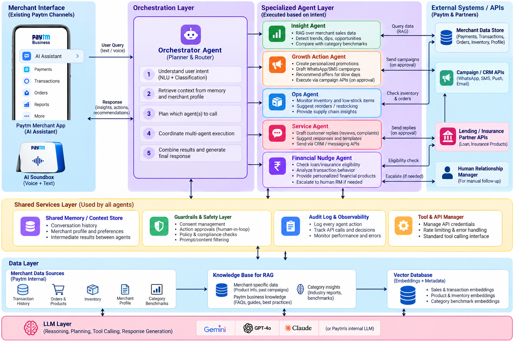

# Vriddhi — AI Growth Copilot for Paytm Merchants

<p>
  
  
  
  
  
  
  
</p>

Paytm merchants already have an AI assistant in their app — read-only, answers when asked. **Vriddhi is the upgrade**: it continuously watches a merchant's own transaction data, *notices* growth opportunities and operational problems on its own, and *executes* the right action once the merchant approves it — a discount promo, a stock reorder, a loan application, an insurance enrollment. A chatbot answers questions. Vriddhi runs the business alongside you.

This is a genuine multi-agent, RAG-grounded, LLM-tool-calling system — not a state machine dressed up to look like one. Every number an agent states is read from the real dataset; every decision about *which* agent to invoke and *what* to say is made by Gemini, live.

## Table of contents

- [System architecture](#system-architecture)
- [What actually happens under the hood](#what-actually-happens-under-the-hood)
- [The 14 tools Gemini can call](#the-14-tools-gemini-can-call)
- [Guardrails & audit trail](#guardrails--audit-trail)
- [Tech stack](#tech-stack)
- [Project structure](#project-structure)
- [Setup](#setup)
- [Running](#running)
- [Demo script](#demo-script)
- [Data](#data)
- [Known limitations](#known-limitations)

## System architecture



This diagram is the target design; the table below is the honest mapping of **what's actually implemented** in this repo against each layer of it.

| Diagram layer | Status | Where it lives |
|---|---|---|
| **Merchant Interface** — Paytm merchant app + AI Soundbox, text/voice query | ✅ simulated | `web/` — a merchant switcher, dashboard, and a chat panel standing in for the app's AI Assistant surface |
| **Orchestration Layer** — Orchestrator Agent (planner & router), 5-step plan → act → combine loop | ✅ real | `server/app/agents/agent_graph.py` — an actual LangGraph `StateGraph` with an `llm` node (Gemini, tools bound) and a `tools` node, looping until Gemini stops calling tools. Gemini decides intent, retrieves context, plans which agent(s)/tools to call, coordinates multi-step execution, and writes the final response — not a scripted if/else chain |
| **Specialized Agent Layer** — Insight, Growth Action, Ops, Service, Financial Nudge | ✅ real (+ 1 more) | `server/app/agents/{insight,growth_action,ops,service,financial}_agent.py`, plus a **Support Agent** (`support_agent.py`) for the merchant's own device/account issues — not in the original diagram, added because a real merchant assistant needs to also handle "my Soundbox volume is low" |
| **External Systems / APIs** — Merchant Data Store, Campaign/CRM APIs, Lending/Insurance Partner APIs, Human RM | ✅ mocked, real contracts | `server/app/services/actions_service.py` + `routes/actions.py` — real guardrail-checked endpoints that log to an audit trail, standing in for the real Paytm/partner APIs |
| **Shared Services Layer** — Memory, Guardrails, Audit Log, Tool Manager | ✅ real | `store/db.py` (persistent JSON-file memory — conversation history, pending recs, active offers, stock overrides), `guardrails/guardrails.py`, `agents/tools.py` (the tool catalog both the scan and chat entry points bind to) |
| **Data Layer** — Merchant Data Sources, Knowledge Base for RAG, Vector Database | ✅ real | `vriddhi_dataset/` (source data) → `rag/knowledge_base.py` (document builders) → `rag/vector_store.py` (an in-memory cosine-similarity store over real Gemini embeddings — no external vector DB needed at this scale, but genuine nearest-neighbor retrieval, not a dict lookup) |
| **LLM Layer** — Gemini / GPT-4o / Claude | ✅ Gemini | `agents/llm.py` — `ChatGoogleGenerativeAI` for reasoning/tool-calling, `GoogleGenerativeAIEmbeddings` (`gemini-embedding-001`) for RAG |

## What actually happens under the hood

Two entry points share one graph:

```
                          ┌─────────────────────────────────────┐
                          │      agent_graph.py  (LangGraph)     │
   scheduled scan  ──────▶│                                     │
   (orchestrator_graph.py)│   ┌────────┐        ┌────────────┐  │
                          │   │  llm   │◀──────▶│   tools    │  │
   merchant chat message ─▶   │ (Gemini│  loop   │ (whichever │  │
   (chat_graph.py)        │   │ +tools)│         │  are bound)│  │
                          │   └────────┘        └────────────┘  │
                          │        │ stops calling tools          │
                          └────────┼───────────────────────────┘
                                   ▼
                          final natural-language answer
```

- **The scheduled scan** binds the 8 read-only diagnostic tools and asks Gemini to build a complete picture of the merchant — sales health, slow movers, stock, upcoming festivals, loan/insurance eligibility, feedback — in whatever order it judges useful, then approve/dismiss cards render in the Dashboard from whatever it drafted.
- **Chat** binds those same 8 tools *plus* 6 action tools (approve/dismiss/end a recommendation, report a stock change, get device support) and lets Gemini interpret the merchant's free text directly — "approve that growth promo", "diwali is coming, should I stock up", "I already sold 25 of these", "end that promo" all resolve to a specific tool call with specific arguments, not a keyword match.
- **RAG is real**: `category_benchmarks.json`, `campaign_templates.json`, `lending_eligibility_rules.json`, a merchant's own reviews, and an authored device-support knowledge base are each embedded once and retrieved by cosine similarity against the merchant's actual question — e.g. asking about "diwali" semantically matches "Diwali (Oct-Nov)" text across every category's benchmark, not a substring check.
- **The LLM never invents a number.** Weekday/weekend ratios, days-to-stockout, loan tiers, festival uplift quantities are all computed in plain Python from the CSV/JSON dataset first; Gemini's job is deciding *which* tool answers the question, judging whether a computed pattern is actually worth flagging, and writing the explanation — grounded in what it was actually handed.

## The 14 tools Gemini can call

| Tool | Bound to | What it grounds its answer in |
|---|---|---|
| `check_sales_pattern` | scan + chat | Weekly weekday/weekend revenue buckets from `transactions.csv`, retrieved benchmark passage from `category_benchmarks.json` |
| `draft_dip_recovery_promo` | scan + chat | The confirmed anomaly + a retrieved promo-template passage; refuses if no anomaly was confirmed first |
| `check_slow_movers` | scan + chat | Catalog-wide sell-through comparison from `catalog.csv` |
| `check_stock_levels` | scan + chat | `stock_qty` vs. `reorder_threshold` + days-to-stockout math |
| `check_festival_readiness` | scan + chat | Parsed seasonal-peak calendar windows + a demand-uplift estimate, semantically matched against a named festival if one was mentioned |
| `check_loan_eligibility` | scan + chat | `lending_eligibility_rules.json` tiers/thresholds, retrieved via RAG |
| `check_insurance_eligibility` | scan + chat | `merchant_insurance` product rules, retrieved via RAG |
| `summarize_feedback` | scan + chat | The merchant's own reviews, retrieved by semantic similarity, not keyword counting |
| `approve_recommendation` | chat only | Whatever's currently pending server-side — executes the real guardrail-checked action |
| `dismiss_recommendation` | chat only | Same targeting, no action taken, just removed from the feed |
| `end_recommendation` | chat only | Whatever's currently **active** (already approved) — stops a running promo/reorder/loan/insurance offer |
| `record_stock_sold` | chat only | Decrements real stock immediately — a merchant-reported sale the system didn't already know about |
| `record_stock_restocked` | chat only | Increments real stock immediately — a reported delivery |
| `handle_device_support_issue` | chat only | An authored troubleshooting knowledge base, retrieved by embedding similarity — Soundbox, QR, settlement, app issues; escalates to a mock support ticket if a fix didn't work |

Every stock change and every approve/dismiss/end is persisted (`server/app/store/db.py`) and immediately visible to every other tool and to the dashboard — not just acknowledged in the chat reply.

## Guardrails & audit trail

Every state-changing action runs through `server/app/services/actions_service.py`, which checks `guardrails/guardrails.py` *before* acting and writes to an append-only audit log *regardless of outcome*:

- Discount can't exceed the configured max (15%)
- Max one promo per customer segment per 14 days
- Max one reorder per item per 3 days
- Loan/insurance requires explicit one-tap consent, max once per 30 days
- A loan auto-approves only if the requested amount is under threshold **and** the merchant's settlement consistency score is ≥ 0.8 — otherwise it's queued for a human relationship manager, never silently approved

Both the REST endpoints (`routes/actions.py`) and every LLM tool call the *same* guardrail-checked functions — there is no path, chat included, that bypasses a check the UI enforces. `GET /api/audit-log/:merchantId` returns the full trail: who/what/when/why, pass or block.

## Tech stack

| Layer | Choice | Why |
|---|---|---|
| Orchestration | LangGraph (`StateGraph`) | Explicit, inspectable agent loop instead of a black-box single call |
| LLM | Gemini (`ChatGoogleGenerativeAI`) | Native tool-calling + structured output via `langchain-google-genai` |
| Embeddings | Gemini (`gemini-embedding-001`) | Real RAG without standing up a separate vector DB service |
| Vector store | In-memory, numpy cosine similarity | The dataset is small; a hosted vector DB would be pure overhead here |
| API | FastAPI | Async, typed request/response models, auto docs at `/docs` |
| State | JSON file (`server/data-store/db.json`) | Survives restarts; no DB server needed for a prototype this size |
| Frontend | React + Vite | Fast dev loop, simple two-view SPA (Dashboard / Chat) |

## Project structure

```
server/
  app/
    agents/
      agent_graph.py        # the actual LangGraph: llm node + tools node, looped
      tools.py               # all 14 tools, built fresh per request (per-merchant closures)
      llm.py                 # Gemini client (chat)
      orchestrator_graph.py  # scan entry point: binds the 8 read-only tools
      chat_graph.py          # chat entry point: binds all 14 tools
      insight_agent.py       # sales-pattern RAG + LLM judgment
      growth_action_agent.py # dip-recovery + slow-mover promo drafting
      ops_agent.py           # restock math + merchant-reported stock changes
      festival_agent.py      # seasonal calendar math + RAG festival matching
      financial_agent.py     # loan + insurance eligibility, RAG-grounded
      service_agent.py       # feedback digest (RAG) + customer autoreply templates
      support_agent.py       # device/account support, RAG over an authored KB
      tracer.py              # structured trace entries for observability
    rag/
      embeddings.py           # Gemini embeddings client
      vector_store.py         # cosine-similarity in-memory store
      knowledge_base.py       # builds each agent's document corpus
    guardrails/guardrails.py
    services/
      actions_service.py      # guardrail-checked, audit-logged state changes
      catalog_service.py       # merges live stock overrides over the CSV snapshot
    store/db.py                # JSON-file persistence: memory, audit log, active offers
    routes/                    # FastAPI routers (merchants, agent, actions, chat, audit-log)
    data/loader.py              # loads vriddhi_dataset/ once at startup
  requirements.txt
  .env.example
web/
  src/
    App.jsx                   # Dashboard / Chat view switcher, all app state
    components/                # RevenueChart, CatalogStatus, RecommendationCard, ChatPanel, ...
    api.js
vriddhi_dataset/                # provided source data — loaded as-is, never regenerated
```

## Setup

```bash
# Backend
cd server
python -m venv venv
./venv/Scripts/activate       # Windows; use `source venv/bin/activate` on macOS/Linux
pip install -r requirements.txt
cp .env.example .env          # then edit .env and paste your GOOGLE_API_KEY

# Frontend
cd ../web
npm install
```

Requirements: Python 3.11+ (built/tested on 3.12), Node.js 20+ (`.nvmrc` pins it), and a [Google AI Studio API key](https://aistudio.google.com/apikey) — the agents won't run without one.

## Running

Two terminals:

```bash
# Terminal 1 — backend, port 4000
cd server
./venv/Scripts/activate
python -m uvicorn app.main:app --port 4000 --reload

# Terminal 2 — frontend, port 5173 (proxies /api to :4000)
cd web && npm run dev
```

Open http://localhost:5173. FastAPI's interactive docs are at http://localhost:4000/docs.

## Demo script

1. Select **Meera Sarees (M001)** — an engineered weekday sales dip in `transactions.csv` gets detected and diagnosed against `category_benchmarks.json`, and a promo is drafted on the top-selling catalog item.
2. Approve the promo card (or type "approve that growth promo" in Chat) — guardrails check live, audit log updates.
3. Switch to **Sharma Kirana (M002)** — low-stock items get flagged with days-to-stockout math.
4. Switch to **Spice Junction QSR (M003)** — an eligible working-capital loan auto-approves.
5. Switch to **Glow Up Salon (M004)** — the same loan logic escalates to a relationship-manager queue instead, because this merchant's settlement consistency score is below threshold.
6. In Chat, try: "why are my sales down", "diwali is coming, should I stock up", "I already sold 25 units of X, update it", "my soundbox volume is low", "do I qualify for insurance", "end that promo".
7. Open the audit log for any merchant to see every action taken, when, and why it passed or was blocked.

## Data

All merchant/catalog/transaction/benchmark data in `vriddhi_dataset/` is provided as-is and loaded at server startup — nothing is invented or regenerated. `transactions.csv` (~17k rows) has a genuine engineered weekday dip for M001; the insight agent detects it from the real numbers, not a hardcoded case.

## Known limitations

This is a hackathon prototype, not a production system:

- Campaign/lending/insurance "partner APIs" are mocked (logged, guardrail-checked, but nothing actually sends a WhatsApp message or hits a bank)
- State is a single JSON file, not a real database — fine for a demo, not for concurrent multi-instance deployment
- No authentication — every endpoint is open, matching the hackathon's single-operator demo scope
